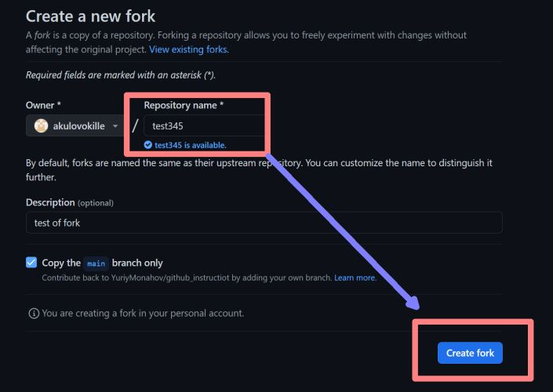

**Что такое GitHub и чем он отличается от Git**
-----------------------------------------------

[GitHub](https://github.com/) — это облачная платформа для хостинга IT-проектов и совместной разработки, под капотом которой находится популярная система контроля версий [Git](https://skillbox.ru/media/code/chto_takoe_git_obyasnyaem_na_skhemakh/), а также полноценная социальная сеть для разработчиков.

### **Репозиторий**

Это просто корневая папка с файлами и вложенными директориями вашей программы — и одновременно её страница на GitHub. Загрузить в репозиторий можно всё что угодно, но предполагается, что вы будете хранить в нём файлы с исходным кодом и какие-нибудь дополнительные материалы — допустим, необходимую для GUI или вёрстки графику (картинки, иконки и тому подобное).

Репозитории могут быть публичными и приватными, в них можно создавать другие папки и отслеживать изменения версий. Управлять своими репозиториями можно прямо через интерфейс сайта, [командную строку](https://docs.github.com/en/github-cli/github-cli/about-github-cli), [десктопное приложение](https://docs.github.com/en/desktop) GitHub или различные средства разработки (IDE), поддерживающие интеграцию с сервисом.

**Создание репозитория и загрузка файлов**
------------------------------------------

Конечно, самый простой способ пользоваться GitHub — через сайт, поэтому начнём отсюда.

*   для создания репозитория нужно нажать на **+** в правом верхнем углу сайта, выбрать пункт **New Repository**, заполнить название и описание, проставить нужные галочки и щёлкнуть на **Create Repository**;
*   для загрузки файлов нужно зайти в нужный репозиторий, щёлкнуть на **Add file** и выбрать **Upload files**.

Шаг 1. Создание GitHub-репозитория в веб-версии_Скриншот: Skillbox Media_

Шаг 2. Страница создания GitHub-репозитория_Скриншот: Skillbox Media_

Но для обучения Тёмной стороне Силы работе с GitHub полезно потренироваться выполнять и другие необходимые в процессе разработки действия: клонирование/форк, объединение веток, просмотр и разрешение конфликтов и другие.

Давайте пошагово пройдём всё это вместе — сначала через сайт, а потом взглянем одним глазком на работу через GUI-клиенты и интерфейс командной строки (CLI).

**Просмотр файлов в репозитории**
---------------------------------

Согласитесь, что в ряде случаев удобно не скачивать исходники, а просто бегло ознакомиться с ними. Для таких простых операций вовсе не нужен десктопный клиент: все файлы можно быстро открыть в веб-версии (и код, и те же картинки). Просто щёлкните по ним для просмотра!

На этой картинке — просмотр файла с кодом. Всё как полагается: есть нумерация строк и подсветка синтаксиса_Скриншот: Skillbox Media_

**Создание сайта из вашего GitHub‑профиля**
-------------------------------------------

Захостить сайт на GitHub можно с помощью функции [GitHub Pages](https://pages.github.com/). Это очень просто:

*   Зайдите в настройки репозитория.
*   В блоке **Code and automation** выберите **Pages**.
*   Выберите источник (**Deploy from a branch**, затем нужную ветку).
*   Кликните на **Save**.
*   Обновите страницу, и вверху страницы появится ссылка на ваш новый сайт.

Пример сайта на GitHub Pages_Скриншот: Skillbox Media_

В случае создания сайта для продвижения себя, а не проекта, просто создайте репозиторий с кодом сайта-визитки и дайте ему имя вида \[username\].github.io, где username — название вашего аккаунта на GitHub. Более подробно про эту функцию — [тут](https://docs.github.com/en/pages).

**Подключение GUI-клиента GitHub Desktop**
------------------------------------------

Если вам удобнее такой способ работы, здесь всё тоже просто. Опять же, повторим кратко выводы из нашего более подробного [гайда](https://skillbox.ru/media/code/instruktsiya_zalivaem_proekt_na_github_bez_komandnoy_stroki/) на эту тему:

*   [Скачиваем](https://desktop.github.com/) и устанавливаем сам клиент.
*   Авторизуемся в своей учётной записи.
*   Работаем с существующими репозиториями или создаём новые (локальные).

Главное меню GUI-клиента GitHub Desktop для Windows. Видим в списке и наш репозиторий skillbox\_cool, описанный выше_Скриншот: Skillbox Media_

Приложение предлагает выполнить клонирование репозитория на локальную машину для дальнейшей работы, что мы и сделаем.

Клонирование репозитория в десктопном клиенте GitHub_Скриншот: Skillbox Media_

Клонированные из удалённого GitHub-репозитория файлы хранятся в специальной папке на вашем компьютере, и в них легко вносить изменения — клиент будет открывать их в выбранном вами редакторе кода / среде разработки (хотя удобнее всё по отдельности — выбрав нужный файл-исходник в папке).
=======
# github_instructions

 dfgjldfjglkg

 *ljfgljs;l-*

## Как сделать pull request

 * Получить ссылку на чужой репозиторий (который собираемся клонировать)

 * Залогиниться в свой github

* На новой вкладке браузера : копируем в адресную строку ссылку на чужой репозиторий
 
 * В интерфейсе github нажимаем кнопку Fork
 
  
* Заполняем форму создания новой "вилки" и нажимаем **Create fork**
 

* В списке собственных репозиториев появляется ссылка на чужой репозиторий
 

* Заходим в форк чужого репозитория, нажимаем кнопку Code, на закладке HTTPS копирем адрес форка в clipboard
 

 * На локальной рабочей станции, в терминале VS Code делаем clone своей версии репозитория:
    git clone https://github.com/akulovokille/test345.git

* В интерфейсе VS Code (explorer) переходим в клонированный репозиторий

 * Создаем новую ветку
    git branch version2

* Переходим в ветку
    git checkout version2

* Открываем какие-либо файлы на редактирование, вносим изменения, сохраняем локально

* Готовим изменные файлы для нового коммита
    git add .

 * Делаем коммит
    git commit -m "Lines 05 and 10 have been changed"
 
 * Отправляем свою версию в свой GitHub
    git push
 
 * На сайте GitHub нажимаем кнопку **Pull request** для отправки изменений на модерацию хозяину репозитория

